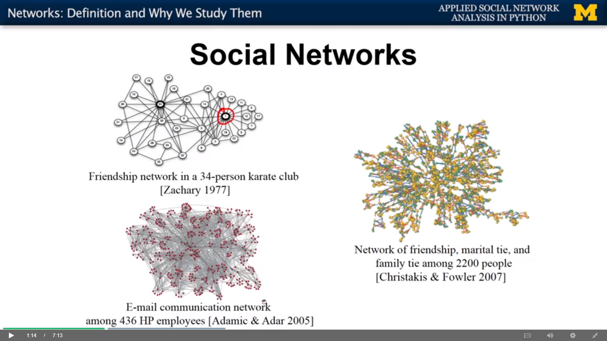
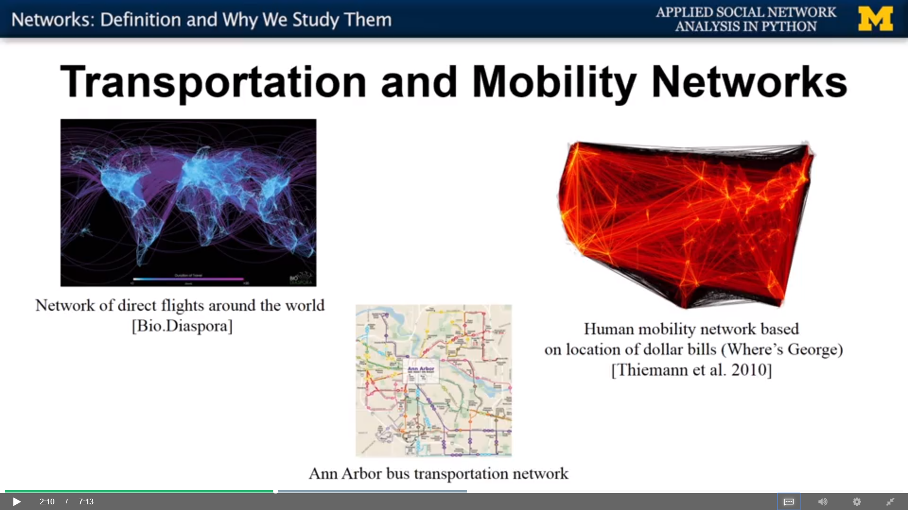
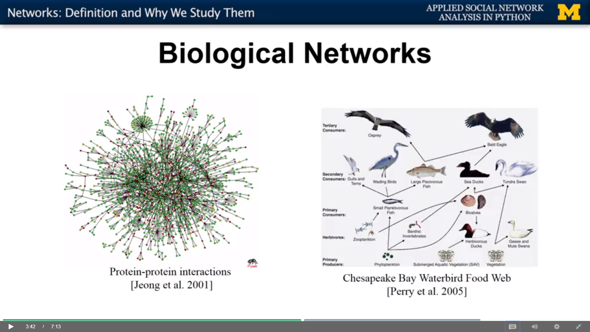

## Different types of network

- Social network
    - Friendship network in 34 person karate club (Node is person, edge is 
    relationship between person. Node 1 is probably an instructor and others
    are students...)
    - Network of friendship, martial tie, family tie (different color represents 
    different relationship)
    - Email communication network. (Network can also come from online world)

 - Transportation and mobility network
    - Directed flights between different areas around the world
    - Human mobility network
    - Bus transportation network
    
    
    
 - Information Network
    - Communication between left-wings and right-wings political blogs (nodes
    are the blogs and edges are the url links between blogs)
    - Internet Connectivity
    - Wikipedia articles about climate change (cluster by sub-topping)
 
 
 
 - Biological network
    - Protein-protein interactions
    - Food web (what animal eats what animal)
 - Financial network
 - Co-authorship network
 - Trade network
 - Citation network
