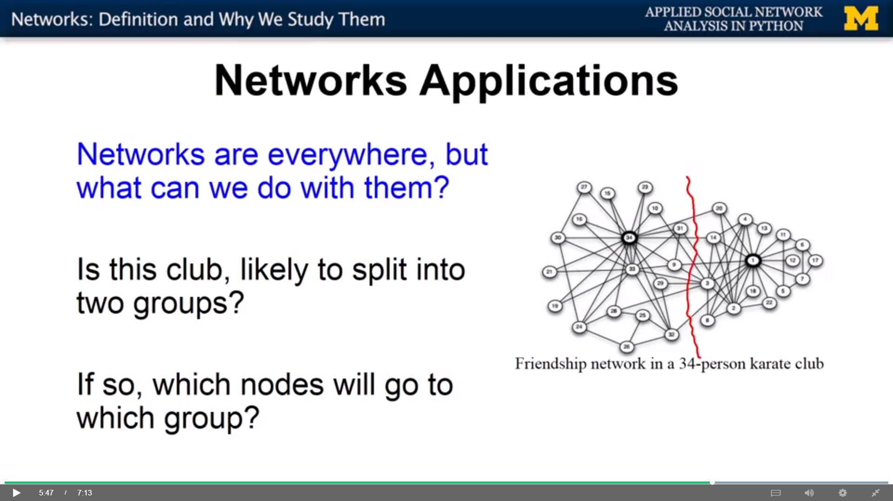
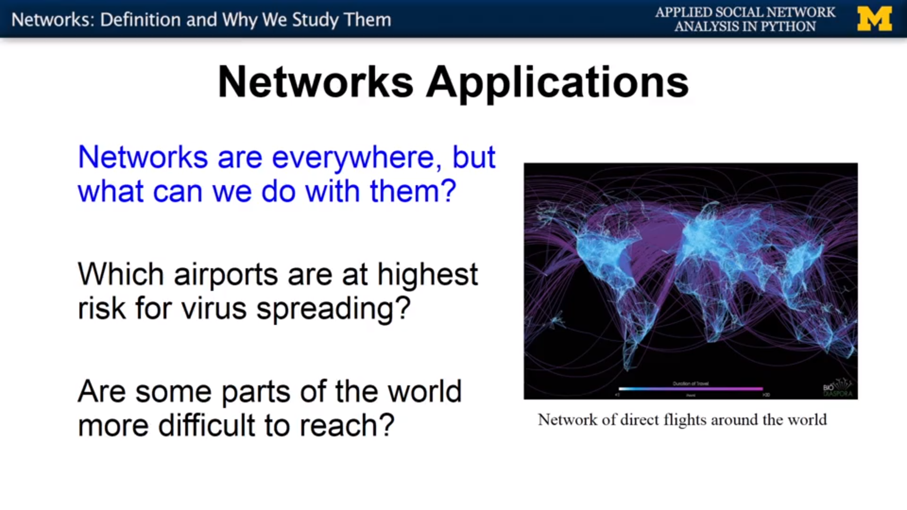

## Application of network analysis

Example of E-mail communication network:
- Is a rumor likely to spread in this network?
    - Rumor starts at some parts and then spread
- Who are the most influential people in the organization?

Example of Karate club network:
- Split into two groups?
- Which node is likely to belong to which group?

Example of directed flights network:
- Which airport is under more risk for virus spreading?
- Are some parts of the world are more difficult to reach?
- What are the key connections that we can make to make those 
areas easy to reach?

