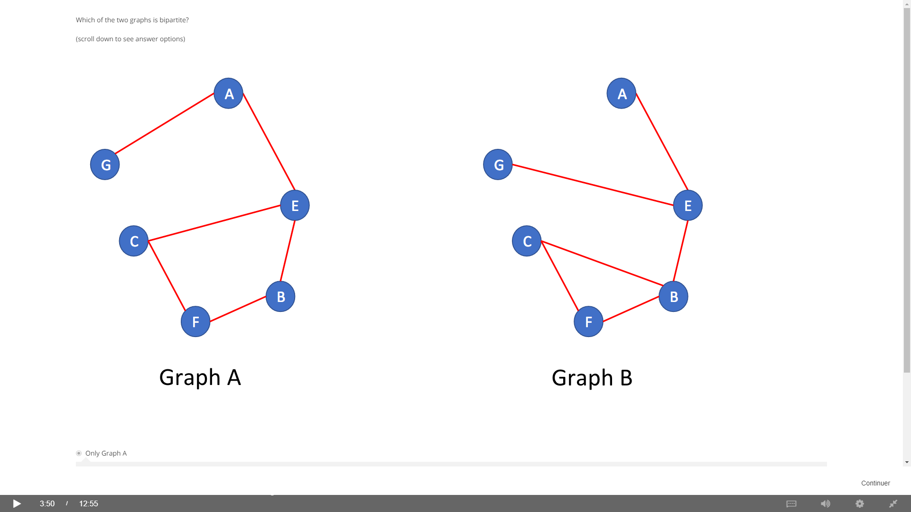

### What is a bipartie graph?

Bipartie graph is a graph where nodes can be split into two sets L and R 
and every edge connects an node in L with a node in R. No inner connections
inside L and R.

```python
from networkx.algorithms import bipartite
import networkx as nx

B = nx.Graph()
B.add_nodes_from(['A', 'B', 'C', 'D', 'E'], bipartite=0)
B.add_nodes_from(['1', '2', '3', '4', '5'], bipartite=1)
B.add_edges_from([('A', '1'), ('B', '1'), ('C', '1'), 
                  ('C', '3'), ('D', '2'), ('E', '3'),
                  ('E', '4'), ('E', '5')])
             
# ==> Check if a graph is a bipartie graph
bipartite.is_bipartite(B)
# True
B.add_edge('A', 'B')
bipartite.is_bipartite(B)
# False

# ==> Check if a set of nodes is in a bipartition of a graph
X = {'A', 'B', 'C', 'D'}
bipartite.is_bipartite_node_set(B, X)
# True
X = {'1', '2', '3', '4'}
bipartite.is_bipartite_node_set(B, X)
# True
X = {'A', 'B', 'C', 'D', '1'}
bipartite.is_bipartite_node_set(B, X)
# False

# ==> Get each set of nodes in bipartie graph
bipartite.sets(B)
# ({'A', 'B', 'C', 'D', 'E'}, {'1', '2', '3', '4', '5'}) 
```

### How to detect if a graph is bipartie?



Graph A is bipartite: the two sets of nodes are {A,B,C} and {E,G,F}. 
All edge connect a node in one set to a node in the other set. 

Graph B is not bipartite: note that nodes C, B, and F form a triangle, 
so it is not possible to assign each of these nodes to a side without 
having edges connecting nodes that were assigned to the same side. 

In fact, for the same reason, __a bipartite graph cannot contain a 
cycle of an odd number of nodes__.

### From Bipartie Graph ==> Projected Graph

 This kind of network could be important for `viral marketing`. 
 
 If two people tend to follow the same teams, 
 they may also like the same other type of product, 
 and so you would be interested in knowing who is likely to 
 impact whom in terms of that other product, and the fact that 
 they follow the same kinds of teams might give you that hint, 
 and so these this kind of network could be useful for certain things.
 
 ```python
import networkx as nx
from networkx.algorithms import bipartite

B = nx.Graph()
B.add_nodes_from([('A', 1), ('B', 1), ('C', 1), ('D', 1),
                  ('H', 1), ('B', 2), ('C', 2), ('D', 2),
                  ('E', 2), ('G', 2), ('E', 3), ('F', 3),
                  ('H', 3), ('J', 3), ('E', 4), ('I', 4), ('J', 4)])

X = {'A', 'B', 'C', 'D', 'E', 'F', 'G', 'H', 'I', 'J'}
P = bipartite.projected_graph(B, X)
# Sometimes we need to get the number of connections between nodes
P = bipartite.weighted_projected_graph(B, X)
```
 
