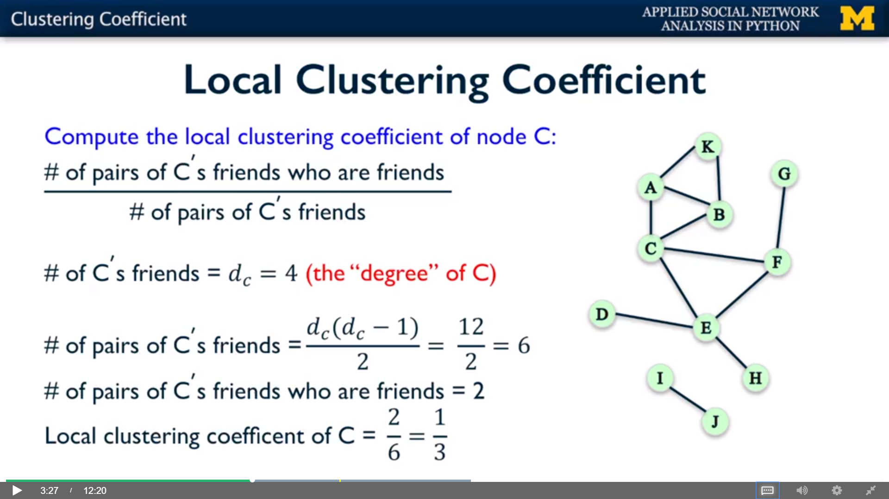

## ==> Local Clustering Coefficient

- What is Triadic Closure ?
    - The tendency for people who share connections to become connected
    - i.e. 可用于发现社交网络中，还未连接的，但可能成为好友的人
- How to measure the prevalence of triadic closure ?
    - Q：Basic Idea on 如何 measure 这种 tendency ?
    - A：那些在网络中快要形成三角形但是还没有形成的，就是我们需要的（三角形的两个边已经有了）

## ==> How to measure clustering coefficient?

### Local Clustering Coefficient



### How to compute local clustering coefficient in NetworkX

```python
import networkx as nx

G = nx.Graph()
G.add_edges_from([('A', 'K'), ('A', 'B'), ('A', 'C'), ('B', 'C'),
                  ('B', 'K'), ('C', 'E'), ('C', 'F'), ('D', 'E'),
                  ('E', 'F'), ('E', 'H'), ('F', 'G'), ('I', 'J')])

print(nx.clustering(G, 'A'))
print(nx.clustering(G, 'F'))
print(nx.clustering(G, 'J'))
```
 
