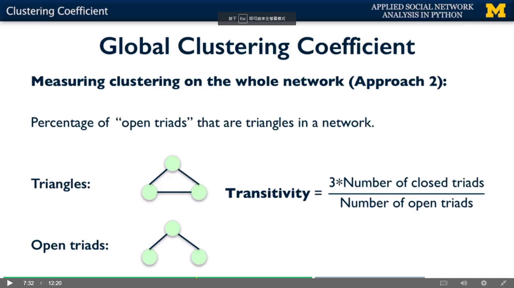

## Global Clustering Coefficient

### ==> Approach 1: Average Local Clustering Coefficient


### Compute Average Local Clustering Coefficient in NetworkX

```python
import networkx as nx

G = nx.Graph()
G.add_edges_from([('A', 'K'), ('A', 'B'), ('A', 'C'), ('B', 'C'),
                  ('B', 'K'), ('C', 'E'), ('C', 'F'), ('D', 'E'),
                  ('E', 'F'), ('E', 'H'), ('F', 'G'), ('I', 'J')])
                  
print(nx.average_clustering(G))
```

### ==> Approach 2: Transitivity



### Compute Transitivity in NetworkX

```python
import networkx as nx

G = nx.Graph()
G.add_edges_from([('A', 'K'), ('A', 'B'), ('A', 'C'), ('B', 'C'),
                  ('B', 'K'), ('C', 'E'), ('C', 'F'), ('D', 'E'),
                  ('E', 'F'), ('E', 'H'), ('F', 'G'), ('I', 'J')])
                  
print(nx.transitivity(G))
```

---

## Comparison of Two Global Clustering Coefficients

- Both of them measures the tendency for edges to form triangles
- __Transitivity weights nodes with large degrees higher__

