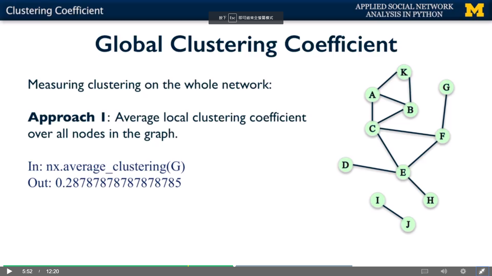

## Global Clustering Coefficient

### ==> Approach 1: Average Local Clustering Coefficient



```python
import networkx as nx

G = nx.Graph()
G.add_edges_from([('A', 'K'), ('A', 'B'), ('A', 'C'), ('B', 'C'),
                  ('B', 'K'), ('C', 'E'), ('C', 'F'), ('D', 'E'),
                  ('E', 'F'), ('E', 'H'), ('F', 'G'), ('I', 'J')])
                  
print(nx.average_clustering(G))
```