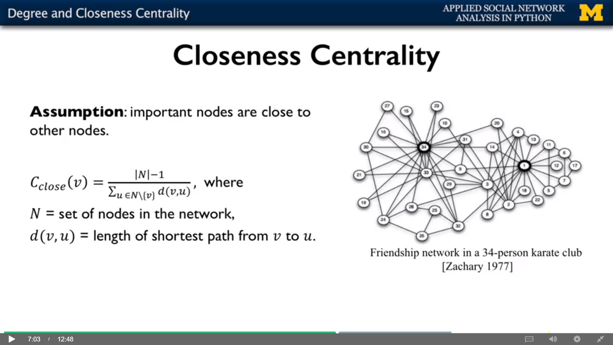

## Note Importance

__==> Q:__ What are the nodes with most importance?

__==> A:__ Different ways of thinking about "importance".
- Degrees of node
- Average proximity to other nodes
- Fraction of shortest path

## Network Centrality

Centrality measures identify the most important nodes in a network:

- Influential nodes in a social network.
- Nodes that disseminate information to many nodes or prevent epidemics.
- Hubs in a transportation network.
- Important pages on the Web.
- Nodes that prevent the network from breaking up.

Centrality Measures 
- Degree centrality 
- Closeness centrality 
- Betweenness centrality 
- Load centrality 
- Page Rank 
- Katz centrality 
- Percolation centrality 

### ==> Degree centrality 
__Assumption:__ important nodes have many connections. 

The most basic measure of centrality: number of neighbors. 
- Undirected networks: use degree 
- Directed networks: use in-degree or out-degree 

```python
import networkx as nx

graph = nx.karate_club_graph()
graph = nx.convert_node_labels_to_integers(graph, first_label=1)
degCent = nx.degree_centrality(graph)
print(degCent[34])
# 0.5151515151515151
print(degCent[33])
# 0.3636363636363636
```

```python
import networkx as nx

G = nx.DiGraph()
G.add_edges_from([('A', 'K'), ('A', 'B'), ('A', 'C'), ('B', 'C'),
                  ('B', 'K'), ('C', 'E'), ('C', 'F'), ('D', 'E'),
                  ('E', 'F'), ('E', 'H'), ('F', 'G'), ('I', 'J')])

degCent = nx.in_degree_centrality(G)
print(degCent)
degCent = nx.out_degree_centrality(G)
print(degCent)
```

### ==> Closeness centrality 
__Assumption:__ important nodes are close to other nodes.


__==> Q:__ How to measure the closeness centrality when a node cannot reach 
all the other nodes?

- Approach 1: Consider only the nodes that L can reach.
    - Problem: sometimes the centrality will be very high
- Approach 2: Consider only the nodes that L can reach and `normalize by
the fraction of nodes that L can reach.`
    - 第二种方法并不会改变第一种方法的结果，如果是一个全连接的图的话，normalize 的部分为1.
 