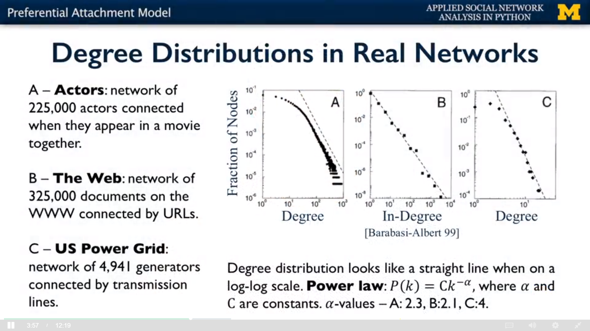

## Degree Distribution

整个网络中 Degree 的分布情况。

```python
import networkx as nx
import matplotlib.pyplot as plt

G = nx.karate_club_graph()
degrees = G.degree()
degree_values = sorted(set(degrees.values()))
histogram = [list(degrees.values()).count(i) / float(nx.number_of_nodes(G)) for i in degree_values]

plt.bar(degree_values, histogram)
plt.xlabel('Degree')
plt.ylabel('Fraction of Nodes')
plt.show()
```

## Degree Distribution in Real World



绝大多数的节点的 degree 很少，很少数的节点的 degree 很大，分布的占比类似于一个倒指数分布。

## 如何解释这种行为？

Preferential Attachment Model. 可以想象，一个经常和其他演员合作的演员，会有更大的概率和新演员合作。

每个新节点可以根据定义加到 n 个已经存在的节点上，n 可以大于 1

## Rich-get-richer Model

与 Preferential Attachment Model 的区别是：

- (1) Pages are created in order, and named 1, 2, 3, . . . , N.
- (2) When page j is created, it produces a link to an earlier Web page according to the
following probabilistic rule (which is controlled by a single number p between 0 and 1).
    - (a) With probability p, page j chooses a page i uniformly at random from among all
earlier pages, and creates a link to this page i.
    - (b) With probability 1−p, page j instead chooses a page i uniformly at random from
among all earlier pages, and creates a link to the page that i points to.
    - (c) This describes the creation of a single link from page j; one can repeat this process
to create multiple, independently generated links from page j. (However, to keep
things simple, we will suppose that each page creates just one outbound link.)

Part (2b) of this process is the key: after finding a random earlier page i in the population,
the author of page j does not link to i, but instead copies the decision made by the author
of page i — linking to the same page that i did.